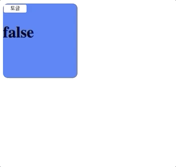

# vue 시작하기



공식문서에 나와 있는 내용을 다룹니다 . 

## 선언적 렌더링

vue.js 의 핵심은 간단한 템플릿 구문을 통해 선언적으로 DOM에 데이터를 렌더링 합니다. 

```javascript
new Vue({
  el:'#app',
  data:{
     msg:'Hello Vue!!'
  }
})
```

* el 로 DOM을 선택한뒤, 
* data를 통해 DOM에서 사용할 데이터를 정의해 줍니다. 
* 그렇게 하면 `{{ msg }}` 이런식으로 그 데이터가 html문서에 자동으로 렌더링 됩니다.

 문자열 템플릿을 화면에 렌더링하는 것은 매우 유사하지만, Vue의 가장 큰 장점은 '**반응형'** 입니다. 

css의 그 반응형 웹이 아니라, 특정 데이터가 변경되면 **자동으로 변경된 데이터로 렌더링** 되는 것을 반응형이라고 합니다. 

{{ }} 을 이용한 문자열 보간 이외에도 다음과 같이 바인딩이 가능합니다. 

```javascript
<div id="app-2">
  <span v-bind:title="message">
    내 위에 잠시 마우스를 올리면 동적으로 바인딩 된 title을 볼 수 있습니다!
  </span>
</div>
=======================JS========================
var app2 = new Vue({
  el: '#app-2',
  data: {
    message: '이 페이지는 ' + new Date() + ' 에 로드 되었습니다'
  }
})
```

v-bind:title에서 title 은 원래 html에서 커서를 올리면 설명을 보여주는 속성인데, v-bind를 통해 title속성에 message data를 추가해 준 것입니다. 


기존의 JQuery를 사용하면 **직접 html을 제어**해서 데이터를 넣어주었습니다. 

이렇게 되면 브라우저에서의 속도도 매우 느려지게 되고, 또 개발하는데 있어서도 너무 불편함이 많았습니다. 

하지만 vue.js 나 React.js 와 같은 최근의 프레임워크 / 라이브러리는 HTML을 제어하는 것이 아니라, data만 제어해 주면, 자동으로 html이 제어되면서 화면이 그려지기 때문에 data가 매우 중요한 요소가 되었습니다. 

`v-` 가 붙어있으면 vue에서 제공하는 특수한 속성임을 나타냅니다.

그렇다면 예제로 true면 붉은 글씨, false면 변화가 없는 글씨를 한번 만들어 볼까요? 

```javascript
<div id="app">
  <div class="text" v-bind:class="{'active':active}">
    {{message}}
  </div>
</div>

========== css =================
.text{
  font-size: 70px;
}
.text.active{
  color:red;
}

========== js ===================
const vm = new Vue({
  el:'#app'
  data:{
         message:'안녕하세요',
         active:true 
       }
})
```

1. message 데이터를 보간을 통해 출력해 줍니다. 
2. v-bind를 통해 class를 제어합니다. 
3. active가 true이면 class에는 active가 추가됩니다. 

## 조건문 , 반복문

### 조건문

조건적 렌더링에는 v-if를 사용합니다. 

```javascript
<div id="app3">
  <p v-if='active'>{{message}}</p>
</div>

=========== JS ===========

const vm = new Vue({
  el:'#app3',
  data:{
    message:'Hello Vue!',
    active:false,
  }
})
```

active가 true이면 message를 렌더링 합니다. 

###  반복문

배열과 같은 데이터를 반복해서 출력할때 사용합니다 . 

```javascript
<div id="app-4">
  <ol>
    <li v-for="todo in todos">
      {{ todo.text }}
    </li>
  </ol>
</div>
==============JS===============
var app4 = new Vue({
  el: '#app-4',
  data: {
    todos: [
      { text: 'JavaScript 배우기' },
      { text: 'Vue 배우기' },
      { text: '무언가 멋진 것을 만들기' }
    ]
  }
})
```

todos 라는데이터안에 각 각 데이터\(객체\)를 todo로 정의해서 반복해서 todo객체 안에 text를 찍어줍니다. 

두가지를 함께 응용하면 다음과 같이 사용할 수 있습니다 . 

```javascript
<div id="app3">
  <ul v-if='active'>
    <li v-for='todo in todos' v-bnid:key='todo.id'>{{todo.text}}</li>
  </ul>
</div>
======================================
const vm = new Vue({
  el:'#app3',
  data:{
    message:'Hello Vue!',
    active:true,
    todos:[
      {id:1,text:'1번째'},
      {id:2,text:'2번째'},
      {id:3,text:'3번째'},
    ]
  }
})
```



v-for 라는 디렉티브는 v-bind:key="" 라는 속성을 추가해 주어야 합니다. 

반복되는 데이터를 넣어주기 때문에 각각 아이템이 가진 고유한 ID같은 것을 key값으로 넣어주세요. 



## 사용자 입력 핸들링

사용자가 마우스와 같은 것을 통해 행하는 이벤트를 다루는 것입니다. 

v-on을 이용해 vue instance 즉 new Vue안에 있는 메서드를 사용할 수 있습니다. 

```javascript
<div id="app-5">
  <p>{{ message }}</p>
  <button v-on:click="reverseMessage">메시지 뒤집기</button>
</div>
==========================================================
var app5 = new Vue({
  el: '#app-5',
  data: {
    message: '안녕하세요! Vue.js!'
  },
  methods: {
    reverseMessage: function () {
      this.message = this.message.split('').reverse().join('')
    }
  }
})
```

* 버튼을 클릭하는 이벤트가 발생하면, reverseMessage 즉, methods 안에 있는 메소드\(함수\)가 실행됩니다.
* 여기서 this는 Vue 인스턴스를 가리킵니다. 즉 this.message는 data에 있는 message가 되겠죠 . 
* split\(''\)은 빈문자열을 기준으로, 문자열을 배열로 만들고, reverse\(\)는 배열순서를 뒤집은뒤 , join\(\)을 통해 다시 합쳐주었습니다.   즉, 문자열 순서를 바꾼 것입니다. 

사용자는 클릭이라는 이벤트를 통해 메소드를 실행하게 되었습니다. 


DOM을 건들이지 않고, 데이터만 바꾸어 주었을 뿐인데 DOM이 바뀌게 되었습니다. 


지금까지 한 예제들은 모두 데이터를 DOM으로 출력만 해주는 단방향으로 데이터를 바인딩 해주었습니다. 

하지만, Vue는 `v-model`을 통해 양방향 즉, DOM \(input , textarea\)에서 입력한 값을 데이터로 입력하는 양방향 데이터 바인딩을 지원합니다. 

```javascript
<div id="app-6">
  <p>{{ message }}</p>
  <input v-model="message">
</div>
==============================
var app6 = new Vue({
  el: '#app-6',
  data: {
    message: '안녕하세요 Vue!'
  }
})
```


예제를 한번 살펴볼까요

```javascript
<div id="app">
  <div class="box" v-bind:class="{'active':toggle}">
    <button v-on:click='onToggle'>토글</button>
    <h1>{{toggle}}</h1>
  </div>
</div>

==========css===========
.box{
  width: 150px;
  height: 150px;
  border-radius:10px;
  background: royalblue;
  cursor: pointer;
  transition:1s;
}
.box.active{
  width:300px;
  height:300px;
}
========== js ===========
const vm = new Vue({
  el:'#app',
  data:{
    toggle:false,
  },
  methods:{
    onToggle (){
      this.toggle = !this.toggle;
    }
  }
})
```



쉽죠??? 

이걸 예전의 JQuery를 통해 만들기 위해서는 .box라는 DOM에 직접 접근을 해서 통제를 해주었습니다. 

이제는 데이터만 관리해주면 알아서 해주니 얼마나 편해졌나요 ??!!


이번에는 **양방향 바인딩**입니다.

```javascript
<div id="app">
  <input type="text" v-model='message'>
  <span>{{message}}</span>
</div>
==============   JS   ===============
const vm = new Vue({
  el:'#app',
  data:{
    message:'양방향'
  },
})
```


