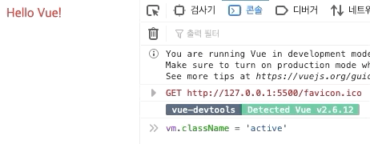

# 템플릿 문법



## v-once

특정 데이터를 출력할때 `{{ }}` 보간 사이에 데이터 이름을 입력하는 것 모두 알고 계시죠? 

```markup
<body>
    <div id="app">
        <div> {{msg}} </div>
        <div> {{msg}} </div>
        <div> {{msg}} </div>
    </div>
    <script>
        const vm = new Vue({
            el:'#app',
            data:{
                msg:'Hello Vue!'
            }
        })
    </script>
</body>
```

이상태에서 vm.msg = 'Vue' 이런식으로 직접 값을 바꿔주면 반응성으로 한번에 모두 리렌더링이 되겠죠? 

v-once를 이용해 보아요. 

```markup
<div v-once> {{msg}} </div>
<div> {{msg}} </div>
<div> {{msg}} </div>
```

이상태에서 콘솔에서 msg값을 바꿔보세요 . 


v-once는 한번만 렌더링하고, 반응성을 체크하지 않아 메모리등을 아낄때 사용하는데, 자주 사용하지는 않습니다. 

## v-html

순순한 html을 불러와 봐요 . 

```markup
<body>
    <div id="app">
        <div> {{msg}} </div>
    </div>
    <script>
        const vm = new Vue({
            el:'#app',
            data:{
                msg:'Hello Vue!<br/>Good Job ~'
            }
        })
    </script>
</body>
```

우리의 의도는 &lt;br/&gt; 태그로 줄바꿈을 진행하고 싶습니다. 

출력하면 어떤 결과물이 출력될까요? 


v-html을 이용하고 비교를 위해 div 태그를 다음과 같이 하나 더 작성해 줍시다. 

```markup
<div id="app">
    <div> {{msg}} </div>
    <div v-html='msg'> {{msg}} </div>
</div>
```


v-html을 사용하면, 순수한 html을 사용할 수 있습니다. 사용하는 경우도 간혹 자주 있습니다.

## JS표현식 넣기

숫자데이터 2를 넣어주고, 보간에 + 2를 적용해서 출력해 주세요. 

```markup
<div> {{msg + 2}} </div>
========================
data:{
    msg:'Hello Vue!<br/>Good Job ~',
    number:2,
}
```

과연 4가 출력될까요? 


보간 내부에서는 JS 문법을 사용할 수 있기 때문에, 표현식을 사용할 수 있습니다. 

이를 이용해 파이값과 , 현재시간을 출력해 보겠습니다. 

```markup
<div> {{Math.PI}} </div>
<div> {{new Date()}} </div>
```


## 클래스명 관리하기

```markup
<style>
        .normal{
            color:red;
        }
        .active{
            color:blue;
            font-weight: bold;
        }
</style>
<body>
    <div id="app">
        <div v-bind:class="className"> {{msg}} </div>
    </div>
    <script>
        const vm = new Vue({
            el:'#app',
            data:{
                msg:'Hello Vue!',
                className:'normal'
            }
        })
    </script>
</body>
```

normal클래스명을 가지고 있다면, 글자색을 빨강으로, active클래스명을 가지고 있다면, 파란색을 적용해 주었습니다. 

그렇다면 className 데이터를 제어하는 것으로 스타일을 바꾸어 줄 수 있겠죠?? 



Vue는 Data를 이용해 DOM을 관리하기 때문에 이에 익숙해 지셔야 합니다. 

`v-bind:class=' '` 를 항상 작성해 주는것은 상당히 번거롭기 때문에`:class=' '` 이렇게 줄여서 사용할 수도 있습니다.  

이를 메소드를 이용해 적용해 볼까요? 

```markup
<div v-bind:class="className" 
     v-on:click='changeClassName'> 
         {{msg}} 
</div>
====================================
<script>
        const vm = new Vue({
            el:'#app',
            data:{
                msg:'Hello Vue!',
                className:'normal'
            },
            methods:{
                changeClassName(){
                    this.className = 'active'
                }
            }
        })
</script>
```


**v-bind** 뿐만 아니라, **v-on**또한 약어를 사용할 수 있는데, `v-on:click=' '` 대신 `@click=' '` 이렇게 사용할 수 있답니다.  

