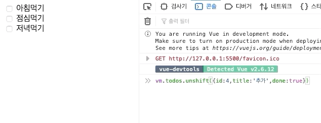
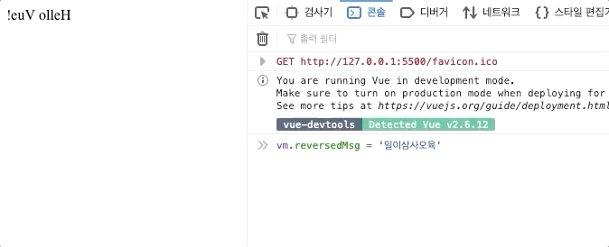
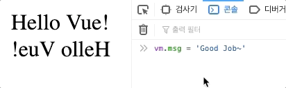

# computed & watch

## computed



먼저 아주 간단한 todo app을 만들어 볼까요? 

```markup
<body>
    <div id="app">
        <div class="todos">
            <div v-for='todo in todos' :key='??????'>
                ???????
            </div>
        </div>
    </div>
    <script>
        const vm = new Vue({
            el:'#app',
            data:{
                todos:[
                    {title:'아침먹기'},
                    {title:'점심먹기'},
                    {title:'저녁먹기'},
                ]
            }
        })
    </script>
</body>
```

todos 를 반복하기 위해 key를 찾으려고 했더니, id가 없습니다. 

id가 없으면, todos를 삭제하거나, 토글할 수도 없겠죠?  

하지만, 이런상황은 생각보다 언제든지 있을 수 있습니다.  

서버에서 데이터를 가져온 경우가 바로 그 경우가 될 수 있는데, 이럴때 todos를 가공하고싶고, 반응성도 유지하고 싶을때 computed를 사용하면 됩니다. 

```markup
<body>
    <div id="app">
        <div class="todos">
            <div v-for='todo in computedTodos' :key='todo.id'>
                <input type="checkbox" v-model='todo.done'> 
                <span> {{todo.title}} </span>
            </div>
        </div>
    </div>
    <script>
        const vm = new Vue({
            el:'#app',
            data:{
                todos:[
                    {title:'아침먹기'},
                    {title:'점심먹기'},
                    {title:'저녁먹기'},
                ]
            },
            computed:{
                computedTodos(){
                    return this.todos.map((todo,index)=>{
                            return{
                            ...todo,  //spread연산자
                            id:index+1,
                            done:false}
                    })
                }
            }
        })
    </script>
</body>
```

computed 즉 계산된 Todos를 이용해 계산된 computedTodos라는 데이터를 생성해 주었고, 그 데이터를 이용해 반복 출력한 결과입니다. 


기존의 데이터에 반응성을 유지하고 데이터를 변경해서 사용하고 싶다면 computed를 사용하면 됩니다. 

또한 기존 todos데이터에 변경이 일어나면 , computed에 만들어진 데이터에도 영향이 갑니다. 



### computed cashing



```markup
<body>
    <div id="app">
        <div>
            {{reverseMsg()}}
        </div>
    </div>
    <script>
        const vm = new Vue({
            el:'#app',
            data:{
                msg:'Hello Vue!'
            },
            methods:{
                reverseMsg(){
                    return this.msg.split('').reverse().join('');
                }
            }
        })
    </script>
</body>
```

전에 문자열을 뒤바꾸는 메소드를 작성한거 기억하시나요? 

> !euV olleH

```markup
<div id="app">
    <div>
        {{msg.split('').reverse().join('')}}
    </div>
</div>
```

위 코드도 같은 결과를 가지고 있습니다. 

거꾸로 나오는 Hello Vue를 여러번 나타나게 해볼까요?

```markup
<div id="app">
    <div>
        {{msg.split('').reverse().join('')}}
    </div>
    <div>
        {{msg.split('').reverse().join('')}}
    </div>
    <div>
        {{msg.split('').reverse().join('')}}
    </div>
</div>
```

이렇게 작성해 줄 수도 있겠지만, 다음과 같이 표현식을 3번 동작시키는 방법을 사용할 수 있습니다. 

reverseMsg를 3번 반복시켜주면 되겠죠?  하지만, reverseMsg가 매우 거대한 기능을 가지고 있다면, 컴퓨터에 부하를 일으킬 수 있습니다. 

이런 경우에는 computed의 캐싱이 아주 좋은 효과를 볼 수 있습니다. 

```markup
<body>
    <div id="app">
        <div>===함수로 매번 출력===</div>
        <div>{{reverseMsg()}}</div>
        <div>{{reverseMsg()}}</div>
        <div>{{reverseMsg()}}</div>
        <div>====computed=====</div>
        <div>{{reversedMsg}}</div>
        <div>{{reversedMsg}}</div>
        <div>{{reversedMsg}}</div>
    </div>
    <script>
        const vm = new Vue({
            el:'#app',
            data:{
                msg:'Hello Vue!'
            },
            computed:{
                reversedMsg(){
                    return this.msg.split('').reverse().join('');
                }
            },
            methods:{
                reverseMsg(){
                    return this.msg.split('').reverse().join('');
                }
            }
        })
    </script>
</body>
```

이렇게 작성해 볼까요? 


computed안에 값들은 함수형식이지만, data로 취급되기 때문에 \(\) 즉, 호출을 시켜주지 않아도 됩니다.



같은 결과를 보여주고 있지만, 둘에게는 차이점이 있습니다. 

1. 위 같은 경우에는 reverseMsg라는 함수를 매번 호출하는 것이지만, 
2. 아래의 경우에는 한번해서 데이터로 담은뒤 \(캐싱\) 그 결과를 3번 뿌려준 것입니다.


즉, 함수나 표현식을 직접 삽입하는 것보다는, computed를 통해 계산을 해놓은뒤 재사용하는 것이 더 효율적인 방법이 될 수 있겠죠? 


### computed의 getter & setter



```markup
<body>
    <div id="app">
        <div> {{reversedMsg}} </div>
    </div>
    <script>
        const vm = new Vue({
            el:'#app',
            data:{
                msg:'Hello Vue!',
            },
            computed:{
                reversedMsg(){
                    return this.msg.split('').reverse().join('');
                }
            }
        })
    </script>
</body>
```

위와 같이 지금까지 사용한 computed의 경우에는 데이터를 읽어오기 위한 getter라고 할 수 있습니다. 

항상 값을 반환해 주어야 하죠. 

또한 위에 reversedMsg는 원래 아래 코드와 같다고 볼 수 있습니다. 

```javascript
computed:{
    reversedMsg:{
        get:function(){
            return this.msg.split('').reverse().join('');
        },
        set:function(){

        }
                    
    }
}
```

> !euV olleH

결과도 잘 출력될 것입니다. 

지금은 setter가 없기 때문에 데이터를 할당할 수 없는데, 한번 추가해 볼까요? 

```javascript
computed:{
    reversedMsg:{
        get:function(){
            return this.msg.split('').reverse().join('');
        },
        set:function(value){
            this.msg = value;
        }
                    
    }
}
```


setter는 매개변수로 할당할 값을 받고, 할당이 목적이기 때문에 return이 필요가 없습니다. 


진짜data안에 들어있는 data를 변경시켜주기 때문에 반응성을 가지게 되겠고, 또 computed된 데이터에도 영향이 가겠죠? 

이제 확인해 보겠습니다. 



`{{reversedMsg}}` 즉 computed된 데이터를 출력해주기 때문에 순서도 바뀌어서 출력되고 있습니다.

일반적으로 setter가 필요한 경우는 거의 없습니다. 하지만, computed데이터에 값을 할당해야 한다면 형식을 방금처럼 바꾼뒤에 추가해 주면 됩니다. 

### 정리

1. computed데이터의 값을 할당해야 하는경우 getter/setter추가하는 문법으로 바꾼다. 
2. setter는 return이 필요없다. 
3. getter는 return하는 값이 있어야 한다.

## watch



먼저 언제나 그렇듯 아래 코드를 적어주세요 .

```javascript
<body>
    <div id="app">
        <div>{{msg}}</div>
        <div>{{reversedMsg}}</div>
    </div>
    <script>
        const vm = new Vue({
            el:'#app',
            data:{
                msg:"Hello Vue!"
            },
            computed:{
                reversedMsg(){
                    return this.msg.split('').reverse().join('');
                }
            }
        })
    </script>
</body>
```


또한 메시지를 변경하게 되면 아래와 같이 둘다 반응성을 가지고 자동으로 변하게 됩니다.



이상태에서 직접 바꾸기 때문에 어떤 시점에 데이터가 바뀌게 되는지 직접 컨트롤 할 수 있는데, 

만약 데이터가 바뀌게 되는 특정 시점에 원하는 로직을 처리하고 싶다면 !! 그때 **watch** 를 사용할 수 있습니다. 

즉, **watch**는 데이터를 **감시**하고 있다가 데이터가 **변경되는 시점**에 **원하는 로직을 실행**해 주는것이죠.

사용법은 다음과 같습니다. 

```javascript
    <script>
        const vm = new Vue({
            el:'#app',
            data:{
                msg:"Hello Vue!"
            },
            computed:{
                reversedMsg(){
                    return this.msg.split('').reverse().join('');
                }
            },
            watch:{
                msg(){
                    
                }
            }
        })
    </script>
```

msg데이터를 감시하고 싶다면 이름을 msg같게 지어주면 됩니다. 

또한 메게변수로는 new Value 즉, 바뀐 데이터를 받아 올 수있습니다. 

```javascript
watch:{
    msg(newMsg){
         console.log('New data: ',mewMsg)
    }
}
```

위와 같이 사용해 줄 수 있는데, 아래와 같이 결과가 출력됩니다.


또한 watch는 computedData도 감시할 수 있습니다. 

아래 코드를 추가해 볼까요? 

```javascript
computed:{
        reversedMsg:{
            get:function(){
                return this.msg.split('').reverse().join('');  
            },
            set:function(v){
                this.msg = v
            }
        }
},
watch:{
        msg(newMsg){
            console.log('New data: ',newMsg)
        },
        reversedMsg(newMsg){
            console.log('New computedData',newMsg)
        }
}
```


1. ReversedMsg의 setter즉, setter를 통해 msg를 갱신해주니, 
2. msg\(\) watch가 실행되었고, 
3. msg가 변경되서 computed 즉, reversedMsg까지 변경을 받아
4. reversedMsg\(\)watch가 실행되었습니다. 

데이터가 변경되는 상태를 감시해주기 때문에,  비동기 처리에 잘 사용될 수 있겠죠??


