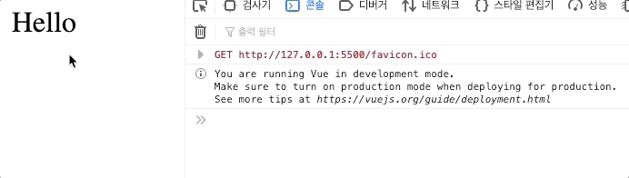

# 사용자 지정 이벤트

사용자 지정 이벤트 즉 `$emit` 를 알아보기에 앞서 필요한 사전개념을 먼저 알아보도록 하겠습니다. 

```markup
<body>
    <div id="app">
        <my-comp :my-msg="message"/>
    </div>
    <script>
        Vue.component('my-comp',{
            template:'<div>{{myMsg}}</div>',
            props:{
                myMsg:{type:[String,Number]},
            }
        })
        const vm = new Vue({
            el:'#app',
            data(){
                return{
                    message:'Hello'
                }
            }
        })
    </script>
</body>
```

* my-comp 라는 컴포넌트가 선언되어있고,
* myMsg라는 property를 받아 출력해주고 있습니다. 
* myMsg는 부모의 message를 받아옵니다. 

> 부모는 vm 자식은 my-comp가 되겠죠?


즉, **부모에서 자식으로 데이터**를 넘겨줄때는 props라는 개념을 사용하게 됩니다. 


그렇다면 반대 즉, 자식에서 부모에게 데이터를 줄수는 있을까요? 

> 기본적으로는 허용되지 않습니다. 하지만, 자식에서 수정한 데이터가 부모에 영향을 끼쳐야 할 경우가 있습니다.

그때 사용되는 것이 바로 `$emit` 입니다. \(조금 복잡해 보일수도 있어요...\)


먼저 컴포넌트에서 글을 누르면 데이터가 변경되도록 하는 method를 만들어 click이벤트를 적용시켜 줍니다.

```markup
<body>
    <div id="app">
        <my-comp :my-msg="message"/>
    </div>
    <script>
        Vue.component('my-comp',{
            template:'<div @click="updateMsg">{{myMsg}}</div>',
            props:{
                myMsg:String,
            },
            methods:{
                updateMsg(){
                    this.myMsg = 'Good!'
                }
            }
        })
        const vm = new Vue({
            el:'#app',
            data(){
                return{
                    message:'Hello'
                }
            }
        })
    </script>
</body>
```



이렇게 하면 동작은 되지만, 다양한 문제점들을 가지고 있습니다. 

조금 복잡해도 다른 방법을 사용해 보겠습니다. 즉, 이벤트를 부모에게 전달해줄 것이에요.

updateMsg메소드를 다음과 같이 변경해 주세요. 

```markup
updateMsg(){
     this.$emit('my-event','Good') 
}
```

1. div를 클릭해 updateMsg메소드를 실행하면
2. 부모요소로 이름이 'my-event'라는 이벤트를 전달할건데 전달하면서 'Good'이라는 값도 전달한다.

my-event를 사용해 보겠습니다. 

```markup
<div id="app">
    <my-comp :my-msg="message" @my-event="updateMessage"/>
</div>
```

updateMessage를 실행할건데, updateMessage라는 메소드를 다시 부모요소에 정의해주어야겠죠?

이때 아까 전달된 값 \('Good'\)을 인자로 받습니다.

```javascript
const vm = new Vue({
    el:'#app',
    data(){
        return{
            message:'Hello'
        }
    },
    methods:{
        updateMessage(value){
            this.message=value;
        }
    }
})
```


이제 전체 코드를 보면서 다시한번 살펴보겠습니다. 

```javascript
<body>
    <div id="app">
        <my-comp :my-msg="message" @my-event="updateMessage"/>
    </div>
    <script>
        Vue.component('my-comp',{
            template:'<div @click="updateMsg">{{myMsg}}</div>',
            props:{
                myMsg:String,
            },
            methods:{
                updateMsg(){
                    //this.myMsg = 'Good!'
                    this.$emit('my-event','Good') 
                }
            }
        })
        const vm = new Vue({
            el:'#app',
            data(){
                return{
                    message:'Hello'
                }
            },
            methods:{
                updateMessage(value){
                    this.message=value;
                }
            }

        })
    </script>
</body>
```

1. 자식컴포넌트 안에 div를 누르면 updateMsg라는 메소드를 실행
2. updateMsg메소드는 그 이벤트를 my-event로 부모에게 전달한다.
3. my-event가 발생하면 특정 updateMessage를 실행시키고,
4. updateMessage는 this.message를 변경시켜준다.

