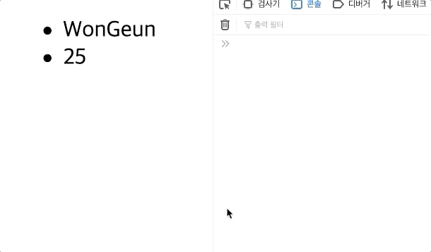
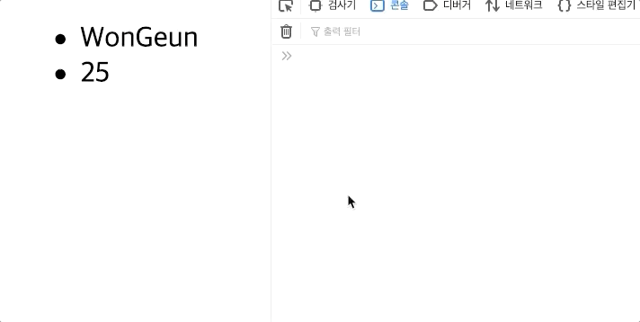
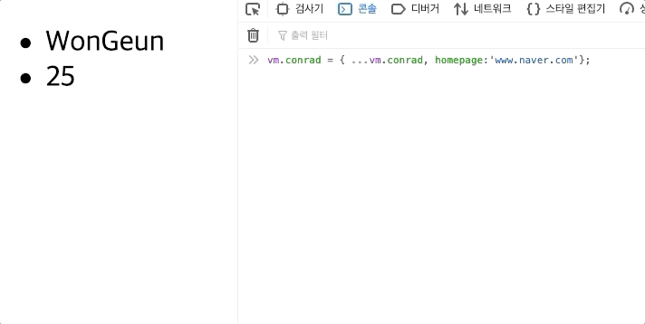

# 리스트 렌더링

## 배열 렌더링

v-for은 배열데이터를 반복해서 그 안에있는 각각의 데이터에 따라 화면에 요소를 반복적으로 렌더링 해주었습니다. 

대표적으로 TodoList가 있었죠 !!  다시한번 만들어 봅시다.

```markup
<body>
    <div id="app">
        <ul class="todos">
            <li v-for='todo in computedTodos' :key='todo.id'>{{todo.title}}</li>
        </ul>
    </div>
    <script>
        const vm = new Vue({
            el:'#app',
            data:{
                todos:[
                    {title:'아침먹기'},
                    {title:'점식먹기'},
                    {title:'저녁먹기'}
                ]
            },
            computed:{
                computedTodos(){
                   return this.todos.map((v,i)=>({
                        ...v,
                        id:i++,
                        done:false
                    }))
                }
            }
        })
    </script>
</body>
```

원래의 데이터에 id값이 들어있지 않기 때문에, 따로 computedTodos를 만들어 주었습니다. 

하지만, 지금 예제와 같이 데이터가 막 변화하지 않는 배열에는 index를 key값으로 사용할 수 있어요. 

li태그를 다음과 같이 변경해주면 됩니다. 

```markup
 <li v-for='(todo , index) in computedTodos' :key='index'>{{todo.title}}</li>
```

보통의 배열 메소드는 두번째 인자로 index값을 받는 경우가 많이 있습니다. 


우리는 여기서 저녁먹기 다음에 야식먹기라는 데이터를 추가해주려고 합니다. 

button을 누르면 pushTodo라는 메소드를 실행시켜 주는 방법으로 구현할 것인데, 한번 아래 코드를 추가해 볼까요? 

```markup
    <div id="app">
        <button @click='pushTodo'>PUSH</button>
        <ul class="todos">
            <li v-for='(todo , index) in computedTodos' :key='index'>{{todo.title}}</li>
        </ul>
    </div>
    ===========================
methods:{
   pushTodo(){
        this.todos.push({title:'야식먹기'});
    }
}
```

하지만 pushTodos\(\)에 만약 코드가 다음과 같았으면 어떻게 되었을 까요?

`this.todos[3] = {titld:'야식먹기'}`

분명 todos배열의 3번 인덱스에는 '야식먹기'라는 데이터가 생성이 되었지만, 반응성이 없어서 리렌더링 되지 않았어요. 

이유는 **배열 변경 감지** 때문입니다.

### 변이 메소드

Vue는 감시중인 배열의 변이 메소드를 래핑하여 뷰 갱신을 트리거합니다. 래핑된 메소드는 다음과 같습니다.

* `push()`
* `pop()`
* `shift()`
* `unshift()`
* `splice()`
* `sort()`
* `reverse()`

뷰 갱신을 트리거 한다는 것은 즉 반응성을 체크해 준다는 것입니다. 


배열데이터에 데이터를 추가하거나 뺄때는 변이메소드를 넣어주세요!!


## 객체 렌더링

이번에는 객체데이터를 반복해서 출력해 보겠습니다 .

```markup
<body>
    <div id="app">
        <ul class="conrad">
            <li v-for="(value, key ,index) in conrad" :key='index'>{{ value }}</li>
        </ul>
    </div>
    <script>
        const vm = new Vue({
            el:'#app',
            data:{
                conrad:{
                    name:'WonGeun',
                    age:25,
                }
            }
        })
    </script>
</body>
```

:key값에 넣어줄게 없기 때문에 index를 사용하려고 하는데, 인자들이 3개나 있습니다. 


* 1번인자: 사용할 데이터
* 2번인자: key     \( 객체는 {key : value} 형태로 이루어져있죠. 
* 3번인자: index


결과를 볼까요? 



그렇다면 아까 배열처럼 데이터를 한번 추가해 보겠습니다. `vm.conrad.homepage = ' www.conrad.github.io '`



추가가 안되었다는 것은 **반응성이 없다**는 것이죠?  하지만, 실제로 콘솔로 데이터를 보면 데이터는 추가가 되었습니다. 

왜 반응성이 없는 것일까요? 

> 이전에 알아보았지만, Vue instance는 생성될때 반응성이 부여가 됩니다. 즉, 생성된 후 추가해주면 반응성이 없다는 것이죠.

지금 당장 사용하지는 않지만, 빈 데이터로 선언을 해주면 해결이 될 것 같습니다. 

```markup
data:{
    conrad:{
        name:'WonGeun',
        age:25,
        homepage:''
    }
}
```


만약 미리 데이터를 정의해 놓을 수 있는 상황이면 어떻게 해야 할까요?? immutality 즉, 불변성이라는 개념이 등장하는데, 이건 검색을 해보시길 바래요... 정말 중요합니다. 

홈페이지 빈데이터를 지워주고, spread연산자를 사용해서 vm.conrad가 참조하는 데이터를 새로 바꿔보겠습니다. 



### Vue.set , this.$set

먼저 전에 배열데이터를 렌더링 했던 코드로 다시 넘어가 보겠습니다. 

```javascript
methods:{
     pushTodo(){
         // 이것 안되요!! this.todos[3] = {title:'야식먹기'}
         Vue.set(this.todos,3,{title:야식먹기})
      }
}
```

> set\(\) 의 첫번째 인자는 수정할 데이터, 두번째에는 index즉 넣을 위치, 세번째는 넣을 데이터를 넣어줍니다.


이렇듯 Vue.set을 사용해서 생성한 instance에는 반응성을 유지하고 써줄 수 있지만, Vue라는 생성자의 set 지금은 쓸 수 있지만, 나중에는 항상 쓸수있지는 않습니다. 

이럴때는 생성해준 Vue 즉, vm에 있는 $set 메소드를 사용해 주면 됩니다. `vm.$set()`

다시 Object.html로 돌아와서 코드를 수정해 주세요. add\(\)메소드, button 추가

```javascript
<body>
    <div id="app">
        <ul class="conrad">
            <button @click='add'>추가</button>
            <li v-for="(value, key ,index) in conrad" :key='index'>{{ value }}</li>
        </ul>
    </div>
    <script>
        const vm = new Vue({
            el:'#app',
            data:{
                conrad:{
                    name:'WonGeun',
                    age:25,
                }
            },
            methods:{
                add(){
                    this.$set(this.conrad,2,'homepage','www.new.com')
                }
            }
        })
    </script>
</body>
```

**this.conrad데이터**의 **homepage key**에 `'www.new.com'`value를 추가한다는 의미가 되겠죠?


내용이 길었지만, 객체나 배열데이터를 자주 다루는 프론트앤드 영역에서는 아주 중요한 내용이었습니다~ 

