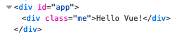

# 전역등록과 지역등록

## 전역등록

먼저 my-component라는 전역 컴포넌트를 하나 만들어 보겠습니다. 

```javascript
<script>
    Vue.component('my-component',{
        template:`<div class='me'>{{ message }}</div>`,
        data:function(){
            return{
                messaga:'Hello Vue!'
            }
        }
    })
    const vm = new Vue({
        el:'#app'
    })
</script>
```


component안에서 사용할 데이터는 일반 객체 형태가 아닌, 함수로만들어서 객체로 return해주어야 합니다.

또한 component를 만들때는 html태그와의 중복을 막기위해 두개이상의 단어로 만들어주세요!!


한번 출력을 해보겠습니다. 

```markup
<body>
    <div id="app">
        <my-component />
    </div>
    <script>
       <!-- 위코드와 동일-->
    </script>
</body>
```



## 지역등록

방금 작성한 컴포넌트는 Vue안에 넣어주었지 때문에 Vue전역에서 사용할 수 있는 컴포넌트였습니다. 

이번에는 특정 구역안에서 사용하는 컴포넌트를 만들어 보겠습니다. 

먼저 id가 app2인 &lt;div&gt;를 만들어주고 새로운 Vue instance vm1 , vm2 를 만들어주세요. 

```markup
<body>
    <div id="app">
        <my-component />
    </div>
    <div id="app2">
        <my-component />
    </div>
    <script>
        Vue.component('my-component',{
            template:"<div class='me'>{{messaga}}</div>",
            data:function(){
                return{
                    messaga:'Hello Vue!',
                }
            }
        })
        const vm1 = new Vue({
            el:'#app'
        })
        const vm2 = new Vue({
            el:'#app2'
        })
    </script>
</body>
```


Vue instance로 직접 넣어주었기 때문에 **\#app / \#app2** 모두 &lt;my-component&gt;를 사용할 수 있었습니다.

이번에는 \#app2에서만 사용할 컴포넌트를 한번 만들어 보겠습니다. 

즉, `Vue.component()`메소드로 생성한 컴포넌트는 **전역컴포넌트**라고 할 수 있습니다.

지역 컴포넌트를 만들때에는 아래 드래그가 된 부분만 있으면 됩니다.


코드를 아래와 같이 수정해 볼까요?

```javascript
const myComp ={
    template:"<div class='me'>{{messaga}}</div>",
    data:function(){
        return{
            messaga:'Hello Vue!',
        }
    }
}
const vm1 = new Vue({
    el:'#app',
    components:{
            'my-component':myComp
    }
})
const vm2 = new Vue({
    el:'#app2'
})
```

* 먼저 myComp라는 변수를 만들어서 아까 드래그한 부분을 넣어주었습니다.
* vm1 즉 \#app 에서 사용하기 위해 components 라는 영역에 'my-component'이름으로 myComp를 할당해 주었습니다. 
* **components**는 지역 컴포넌트를 사용하기 위한 속성입니다.
* vm2에는 등록을 안해주었습니다.

결과를 확인해보면, myComp는 하나가 렌더링 되고, console창에 다음과 같은 에러가 나와있을 것입니다.


```javascript
<div id="app">
    <my-component />
</div>
<div id="app2">
    <my-component />
</div>
```

> app2 즉 vm2에서는 my-component를 사용한다고 지정해주지 않았기 때문입니다.


참고로 지역컴포넌트명을 Camel케이스로 사용하고 html태그도 &lt;myComp&gt;이렇게 한다면 최신문법에서는 작동하지만, 기본적인 방식은 아닙니다!! 

컴포넌트 명을 myComp 로 했더라도 태그명을 my-comp로 입력하면 정상작동 합니다. \(camel-&gt;kebab\)


그렇다면 es6의 향상된 객체기능을 이용해 더 쉽게 사용할 수 있겠죠? 

```javascript
<my-comp/>
================
components:{
     myComp,
}
```

이렇게 사용해도 정상적으로 작동된답니다.

