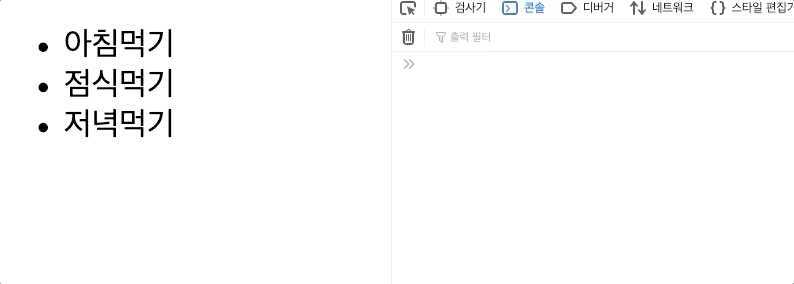

# 이벤트 핸들링

## 메소드 이벤트 핸들링

먼저 아래 코드를 준비해주세요. 

```markup
<!DOCTYPE html>
<html lang="en">
<head>
    <meta charset="UTF-8">
    <meta name="viewport" content="width=device-width, initial-scale=1.0">
    <title>Document</title>
    <script src="https://cdn.jsdelivr.net/npm/vue/dist/vue.js"></script>
</head>
<body>
    <div id="app">
        <ul>
            <li v-for='(todo,i) in todos' :key='i'>{{todo.title}}</li>
        </ul>
    </div>
    <script>
        const vm = new Vue({
            el:'#app',
            data:{
                todos:[
                    {title:'아침먹기'},
                    {title:'점식먹기'},
                    {title:'저녁먹기'}
                ]
            }
        })
    </script>
</body>
</html>
```

여기서 대표적인 click이벤트를 바인딩해줍니다. 

```markup
<body>
    <div id="app">
        <ul>
            <li v-for='(todo,i) in todos' 
                :key='i'
                @click='clickMethod'>
              {{todo.title}}
            </li>
        </ul>
    </div>
    <script>
        const vm = new Vue({
            el:'#app',
            data:{
                todos:[
                    {title:'아침먹기'},
                    {title:'점식먹기'},
                    {title:'저녁먹기'}
                ]
            },
            methods:{
                clickMethod(title){
                    console.log(title)
                }
            }
        })
    </script>
</body>
```

클릭메소드는 만약 받을 인자가 없다면 이벤트 객체를 아래와 같이 인자로 받습니다.


그렇다면 만약 아침먹기를 클릭하면 아침먹기를 출력하기 위해서는 어떻게 해야 할까요? 

> 함수를 실행할때 인자를 넣어주면 되겠죠?

```markup
<li v-for='(todo,i) in todos' 
    :key='i'
    @click='clickMethod(todo.title)'>
  {{todo.title}}
</li>
```

하지만, 이렇게 되면 이벤트 객체를 사용할수가 없게 됩니다... 이 경우에는 `$event`를 함께 넣어주면 됩니다. 

```markup
<li v-for='(todo,i) in todos' 
    :key='i'
    @click='clickMethod(todo.title,$event)'>
  {{todo.title}}
</li>
====== 메소드도 인자를 2개 받도록 수정 =======
methods:{
   clickMethod(title,event){
         console.log(title,event)
   }
}
```


그렇다면 event객체를 어떻게 활용할 수 있을까요?? 

한번 element의 클래스명을 확인해 보아요 . 

```markup
<body>
    <div id="app">
        <ul>
            <li v-for='(todo,i) in todos' 
                :key='i'
                :class="(i+1)+('item')"
                @click='clickMethod(todo.title,$event)'>
              {{todo.title}}
            </li>
        </ul>
    </div>
    <script>
        const vm = new Vue({
            el:'#app',
            data:{
                todos:[
                    {title:'아침먹기'},
                    {title:'점식먹기'},
                    {title:'저녁먹기'}
                ]
            },
            methods:{
                clickMethod(title,event){
                    console.log(title,event)
                    console.log(event.currentTarget.className)
                }
            }
        })
    </script>
</body>
```

클래스명을 bind해주고, method에서 출력해주도록 만들었습니다. 



이번에는 `@click` 이벤트를 걸어주었을때 기존의 **click메소드 뿐만 아니라 다른 메소드도 함께** 사용하고 싶을때의 방법을 알아보겠습니다.

우선 메소드를 추가해 주세요. \( 알아보기 위해 번호가 출력되게끔 해주었습니다.\)

```markup
            methods:{
                clickMethod(title,event){
                    console.log('click1')
                    console.log(title,event)
                    console.log(event.currentTarget.className)
                },
                clickMethod2(){
                    console.log('click2')
                }
            }
```

실행하는 방법도 간단합니다. 

```markup
<li v-for='(todo,i) in todos' 
    :key='i'
    :class="(i+1)+('item')"
    @click='clickMethod(todo.title,$event); clickMethod2()'>
  {{todo.title}}
</li>
```

단, 주의사항이 있습니다. 


함수 호출 사이에 ; 을 입력해서 마무리 되었다는 것을 명시해 주세요.

또한 만약에 인수로 전달할게 없어도 여러개의 메소드를 작동시킬때는 `()`를 이용해 꼭 호출해주세요/


## 이벤트 수식어

submit 이벤트는 기본적으로 새로고침이 되는 이벤트가 일어나게 되는데 우리는 그걸 막아주기 위해서 e.preventDefault\(\)를 매우 자주 호출했을 것입니다. 

이 문제를 해결하기 위해, Vue는 `v-on` 이벤트에 **이벤트 수식어**를 제공합니다. 수식어는 점으로 표시된 접미사 입니다.

* `.stop`버블링을 막아준다.
* `.prevent`e.preventDefault\(\)
* `.capture`이벤트 캡쳐링
* `.self`해당하는 요소만 사용하겠다.
* `.once`한번만 사용하겠다.
* `.passive`모바일에서 스크롤이벤트와 터치이벤트의 출돌을 막기위해 사용.

먼저 child와 부모를 클릭했을 때 이벤트가 일어나도록 하기 위한 코드를 작성해 보겠습니다.

```markup
<style>
    .parent{
        width: 200px;
        height: 200px;
        background: blue;
    }
    .child{
        width: 100px;
        height: 100px;
        background: red;
    }
</style>
<body>
    <div id="app">
        <div class="parent">
            <div class="child"></div>
        </div>
    </div>
    <script>
        const vm = new Vue({
            el:'#app',
        })
    </script>
</body>
```

여기서 parent를 클릭하면 클래스명parent / child를 클릭하면 클래스명 child가 나오도록 메소드를 만들어 보겠습니다. 

```markup
<body>
    <div id="app">
        <div class="parent" @click="clickHandler">
            <div class="child" @click="clickHandler"></div>
        </div>
    </div>
    <script>
        const vm = new Vue({
            el:'#app',
            methods:{
                clickHandler(e){
                    console.log(e.currentTarget.className)
                }
            }
        })
    </script>
</body>
```

> 하지만, 결과는 parent를 누르면 parent만 찍히지만, 
>
> child를 누르면 parent와 child가 함께 찍힐것입니다.  
>
> child가 parent영역 안에 있기 때문이죠!  이것을 바로 **이벤트 버블링**이라고 합니다.
>
>  **child를 누르면 위에있는 child가 먼저 찍히고 그뒤 아래 parent가 찍힌다는 것을 기억해주세요!**

이벤트 버블링을 막아주는 수식어인 .stop을 사용해 보아요.

```markup
<div class="parent" @click="clickHandler">
     <div class="child" @click.stop="clickHandler"></div>
</div>
```

또한 아까 child가 먼저 찍힌것 기억 하시죠? 

이번에는 `.capture`을 사용해 봅시다.

```markup
<div class="parent" @click.capture="clickHandler">
    <div class="child" @click="clickHandler"></div>
</div>
```


마지막으로 .self를 사용해 보겠습니다. 

child에 있는 click이벤트를 없애주세요.

```markup
<div class="parent" @click="clickHandler">
    <div class="child"></div>
</div>
```

이렇게 하면, 어디를 클릭하던 parent가 찍히겠죠?? 

parent에 `.self`를 넣어준뒤 실행하면 , child영역을 클릭하면 반응하지 않고, **보여지는 parent영역을 클릭했을 때**만, clickHandler 이벤트가 동작 될 것입니다. 

## 키수식어

먼저 언제나 그렇듯 먼저 코드 셋팅을 해주세요. 

키 수식어는 사용자의 키보드 입력과 관련된 이벤트이기 때문에 관련 이벤트를 걸어줍니다. `@keydown`

```markup
<body>
    <div id="app">
        <input type="text" @keydown="keydownHandler">
    </div>
    <script>
        const vm = new Vue({
            el:'#app',
            methods:{
                keydownHandler(e){
                    console.log('Done!')
                }
            }
        })
    </script>
</body>
```

하지만, 이렇게 되면 어떤 키를 입력하더라도 항상 Done! 이라는 문자열이 출력될 것이에요.... 

엔터키가 입력되었을 때만 출력이 되도록 코드를 바꿔보겠습니다. 

```javascript
keydownHandler(e){
    if(e.keyCode===13){
         console.log('Done!')  
     }
}
```

> 엔터키의 키코드는 13입니다.

이 방법은 키 수식어를 사용하지 않은 방법입니다. 

vue에서 제공하는 `.enter`키 수식어를 사용하면 조금더 편하게 사용할 수 있습니다.

```javascript
<body>
    <div id="app">
        <input type="text" @keydown.enter="keydownHandler">
    </div>
    <script>
        const vm = new Vue({
            el:'#app',
            methods:{
                keydownHandler(e){
                      console.log('Done!')  
                }
            }
        })
    </script>
</body>
```

공식문서를 한번 확인해 볼까요? 

* `.enter`
* `.tab`
* `.delete` \(“Delete” 와 “Backspace” 키 모두를 캡처합니다\)
* `.esc`
* `.space`
* `.up`
* `.down`
* `.left`
* `.right`

> 물론 .enter 는 키코드로 .13이런식으로 사용할 수도 있습니다.
>
> 또한 위에 나와 있는 키이름 외에도 다른 키이름도 입력이 가능하지만, 브라우저에 따라 동작을 안할 수도 있습니다. \(ex: 'page-down'\)

### 시스템 수식어 키 <a id="&#xC2DC;&#xC2A4;&#xD15C;-&#xC218;&#xC2DD;&#xC5B4;-&#xD0A4;-&#xBAA9;&#xB85D;"></a>

또한 2.1.\* 버전부터는 아래 키들도 사용할 수 있습니다.

* `.ctrl`
* `.alt`
* `.shift`
* `.meta` :mac os의 command키 / window os는 window키

### 키 수식어 중복 \(체인\)

아까 입력한 코드에 체이닝을 적용해 볼까요? 

```javascript
<input type="text" @keydown.ctrl.enter="keydownHandler">
```

**ctrl + enter 키를 함께 누르면** Done! 이 출력되는 것을 확인할 수 있습니다.

