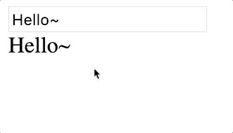
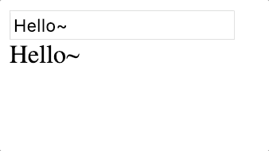
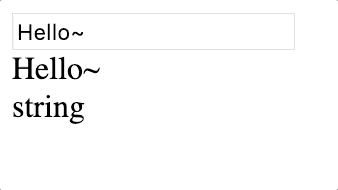

# 폼 입력 바인딩

폼이란 흔히 html에서 자주 사용하는 입력양식요소를 의미하죠?

이러한 양식요소를 사용하기 위해 v-model이라는 디렉티브를 제공하고 있습니다.

## v-model

```markup
<body>
    <div id="app">
        <input type="text" value="input value!!">
    </div>
    <script>
        const vm = new Vue({
            el:'#app',
            data:{
                message:'Hello~'
            }
        })
    </script>
</body>
```


value라는 속성에 있는 값이 바인딩 되었기 때문에 message데이터도 value속성에 바인딩한다는 생각을 많이 하실 수 있습니다. 

바인딩을 위해서는 `:value='message'` 이렇게 넣어주면 되겠죠? 

그러면 값을 한번 변경해 보고 vm.message를 출력해보세요


이상하지 않은가요?? value는 바뀌었는데, 정작 데이터는 바뀌지 않았어요 . 

> 즉, 양방향 바인딩이 일어나지 않은 것이죠.


`v-bind (:)` 로 바인딩한 데이터는 데이터가 들어오기는 하지만 보내주지는 않습니다.


input에서 변경되는 값이 실질적으로 message데이터에도 영향을 주게 만들기 위해서는 `v-model`을 사용하면 됩니다.

확인을 위해 `{{message}}`도 함께 출력해 주세요.




단, 영어로 입력할 경우 바로바로 데이터가 갱신되는데, 한글을 입력할 경우에는 v-model을 사용하는 것은 문제가 있을 수 있습니다.


### 한글사용시

한글의 경우에는 다음과 같이 사용할 수 있습니다.

```markup
<input type="text" @input="message=$event.target.value">
```

하지만 보통 이러한 기능을 바로 입력하지는 않기 때문에 메소드로 분리해 주겠습니다.

```markup
<body>
    <div id="app">
        <input type="text" @input="bindMessage">
        <div>{{message}}</div>
    </div>
    <script>
        const vm = new Vue({
            el:'#app',
            data:{
                message:'Hello~'
            },
            methods:{
                bindMessage(e){
                    this.message = e.target.value
                }
            }
        })
    </script>
</body>
```

잘 작동이 되지만, 새로고침을 한다면 값이 없어져있을 것입니다. `v-model`이 없기 때문에

해결하기 위해서 `:value` 를 이용해 먼저 단방향으로 연결을 해주세요!!

```markup
<input type="text" @input="bindMessage" :value='message'>
```

### v-model수식어

v-model을 이용해서 완성한 input이 항상 옳은것은 아닙니다. 

실시간으로 입력을 반영하는 것이 아닌, 입력을 마쳤을때만 반영시켜주고 싶은 상황이 자주 있을것이에요.

```markup
<input type="text" @change='message = $event.target.value' :value='message'>
```

`@change`라는 이벤트는 값변경이 완료 즉, 포커스가 다른곳으로 옮겨졌을때 반영이 됩니다. 

물론 `v-model`이 아니기 때문에 `:value`값을 message로 설정해주었어요.



@change는 자주 사용되기 때문에 vue에서 수식어를 제공하고 있습니다. 

#### `.lazy`

.lazy수식어를 사용하면 @change와 동일한 효과를 얻을 수 있습니다.

```markup
<input type="text" v-model.lazy='message'>
```

#### `.trim`

사용자가 만약 `"    Hello Vue"` 이런 데이터를 입력했을 때 `.trim`을 사용하면 `vm.message.trim()`과 동일한 효과를 얻을 수 있습니다.

#### `.number`

input창에서 입력하는 데이터는 기본적으로 문자데이터입니다. 만약 사용자가 123을 입력하더라도 값은 `'123'` 이 되는 것이죠!!

.number를 사용하면 number타입으로 자동으로 변환을 해줍니다. `parseFloat("1")`과 같은 효과를 얻는것이에요.

```markup
<div id="app">
    <input type="text" v-model.number='message'>
    <div>{{message}}</div>
    <div>{{typeof message}}</div>
</div>
```

한번 확인해 볼까요?? 




