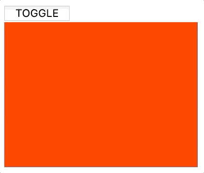
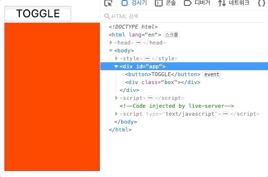
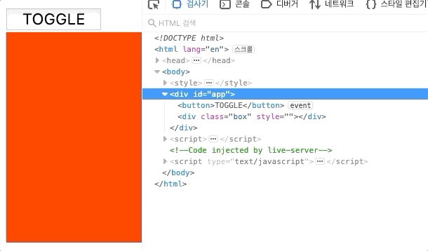

# 조건부 렌더링

## v-if

전에 v-if에 대해 학습했는데, 이번에는 조금더 자세하게 알아보도록 하겠습니다. 

먼저 색상의 상태에 따라서 다른 렌더링을 해주는 코드를 만들어 보겠습니다. 

```markup
<body>
    <style>
        .box{
            width: 100px;
            height: 100px;
        }
        .box--red{
            background-color: red;
        }
    </style>
    <div id="app">
        <div v-if="colorState==='red'"
             class = 'box box--red'></div>
    </div>
    <script>
        const vm = new Vue({
            el:'#app',
            data:{
                colorState:'red',
            }
        })
    </script>
</body>
```


근데 여기에 만약 colorState = 'blue' 라면 파란색박스를 보여주고 싶습니다. 

```markup
<body>
    <style>
        .box{
            width: 100px;
            height: 100px;
        }
        .box--red{
            background-color: red;
        }
        .box--blue{
            background-color: blue;
        }
    </style>
    <div id="app">
        <div v-if="colorState==='red'"
             class = 'box box--red'></div>
    </div>
        <div v-if="colorState==='blue'"
             class = 'box box--blue'></div>
    <script>
        const vm = new Vue({
            el:'#app',
            data:{
                colorState:'red',
            }
        })
    </script>
</body>
```

위처럼 `colorState='blue'`면 파란박스를 렌더링하는 style과 div를 추가해 볼까요? 


이번에는 red나 blue가 아닌 그 외의 값을 가지고 있다면 회색박스를 출력해보겠습니다.

```markup
<style>
    .box{
        width: 100px;
        height: 100px;
    }
    .box--red{
        background-color: red;
    }
    .box--blue{
        background-color: blue;
    }
    .box--gray{
        background-color: gray;
    }
</style>
<div id="app">
    <div v-if="colorState === 'red'"
         class = 'box box--red'></div>
    
    <div v-if="colorState === 'blue'"
         class = 'box box--blue'></div>
    <div v-if="colorState !== 'blue' && colorState !== 'red'"
         class = 'box box--gray'></div>
</div>
```

여기까지는 구현이 가능했지만, 사실 vue에서는 분기문중에 `v-if`만 제공하고 있는 것이 아닙니다. 

### v-if-else-if , v-else

JS에서도 if-else , if-elseif 등등 여러가지 조건문들을 제공하고 있는데, vue에서도 똑같습니다. 

위에서 작성한 코드를 리팩토링 해보겠습니다.

```markup
<div id="app">
   <div v-if="colorState === 'red'"
        class = 'box box--red'></div>
   <div v-else-if="colorState === 'blue'"
        class = 'box box--blue'></div>
   <div v-else
        class = 'box box--gray'></div>
</div>
```

이렇게 if-else-if문을 사용되면 만약 colorState가 red 라면, 뒷부분을 검사하지 않기 때문에 효과적으로 if문을 사용할 수 있겠죠? 


단, 이 경우 if디렉티브는 모두 같은 부모를 공유하는 형제요소여야 합니다.



## v-show

먼저 버튼을 클릭하면 toggle메소드가 실행되서 boolean데이터 값을 반전시켜주는 코드를 작성해 볼까요?

```markup
<body>
    <style>
        .box{
            width: 200px;
            height: 150px;
            background: red;
        }
    </style>
    <div id="app">
        <button @click='toggle'>TOGGLE</button>
        <div class="box"></div>
    </div>
    <script>
        const vm = new Vue({
            el:'#app',
            data:{
                show:true,
            },
            methods:{
                toggle(){
                    this.show = !this.show
                }
            }
        })
    </script>
</body>
```


먼저 무난하게 `v-if` 를 사용할 수 있겠죠? 코드를 수정해 보아요.

```markup
<div v-if='show' class="box"></div>
```



이상태에서 개발자도구를 보면 다음과 같이 실행이 될것이에요. 



요소가 완전히 사라졌다가 나타났다가 반복됩니다. 


이런식으로 v-if를 사용하면 boolean의 여부에 따라 html코드에서 완전히 제거가 됩니다. 


하지만, 이런방식은 깔끔하기는 해도 계속 코드를 변경해주기 때문에 효율적이지는 못합니다. 

한번 `v-show`를 이용해 코드를 변경해 볼까요? 

```markup
<div v-show='show' class="box"></div>
```

결과도 한번 개발자도구를 통해 봐주세요 .



**v-show**를 사용해 주었더니, 코드에는 남아있지만, 요소가 출력되지 않도록 **display**속성을 **none**으로 부여하고 있습니다.

* v-if는 요소 자체를 완전히 코드상에서 제거시킵니다. 
* v-show는 요소를 보이지 않도록만 만들어 줍니다. 


공식문서에서는 **v-if**는 **토글비용이 높다**고 합니다. 

반면에 **v-show**는 **초기 렌더링 비용이 높다**고 설명하고 있죠. 

* 토글비용 : 코드를 그렸다가 지웠다가 그렸다가 지웠다가 하기 때문에 토글비용이 높다.
* 렌더링 비용: v-if는 조건이 false면 아예 초기에 렌더링을 안하기 때문에 무조건 렌더링을 하는 v-show       보다 렌더링 비용이 낮다고 할 수있습니다.

**매우 매우 자주 바꾸기를 원하면 v-show**, 런타임시 **조건이 바뀌지 않으면 v-if**를 권장합니다. 

즉 **일반적으로는** `v-if`를 사용하면 됩니다. 



